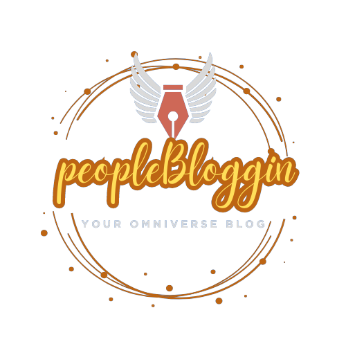

## PeopleBloggin 

PeopleBloggin is a web application built using the Laravel PHP
framework. It provides a platform for users to create and manage their
personal blogs, share articles, and interact with other users. 
What makes it apart from the other blog applications? it's the simplicity, the simple yet attractive design, and the diversity of the topics, that's where -your omniverse blog- came from!


### Features User Registration and Authentication: 
Users can sign up for an
account, log in, and manage their profile. 
Blog Creation and Management:
Users can create their own blogs, write articles, and manage their blog
posts. 
Article Sharing: Users can share their articles with others,
allowing for increased visibility and engagement. User Interaction:
Users can comment on articles, like/dislike posts, and follow other
users. 

### Installation 
To run the PeopleBloggin application locally, follow these steps:

Clone the repository: 
git clone
https://github.com/Njoura7/peopleBloggin_Laravel.git 
Navigate to the project directory: 
cd peopleBloggin_Laravel 
Install dependencies:
composer install 
Create a copy of the .env.example file and rename it to
.env. 
Update the necessary configuration settings, such as the database
credentials. 
Generate an application key: 
```php artisan key:generate ```

Run database migrations: 
``` php artisan migrate ```

Start the development server:
``` php artisan serve```

Access the application in your browser at http://localhost:8000. 
Please note that you may need to set up a local
development environment with PHP and a supported database (e.g., MySQL) before running the application.

### Contributing 

If you wish to contribute to PeopleBloggin Laravel, please
follow these guidelines:

Fork the repository on GitHub. Create a new branch for your feature or
bug fix: git checkout -b feature/your-feature or git checkout -b
bugfix/your-bug-fix. Make your changes and commit them with descriptive
commit messages. Push your branch to your forked repository. Submit a
pull request to the develop branch of the main repository. Provide a
clear description of your changes and why they should be merged. License
This project is licensed under the MIT License. Feel free to use,
modify, and distribute the code as per the terms of the license.

Contact For any inquiries or feedback, please contact the project
maintainer:

Name: Anas Mohamed Aziz Najjar
Email: njourawebdev@gmail.com

You can also submit issues on the GitHub repository for bug reports or
feature requests.

This is a brief overview of the PeopleBloggin Laravel application. For
more detailed information, including code structure, dependencies, and
usage instructions, please refer to the project documentation and source
code available on the GitHub repository.
